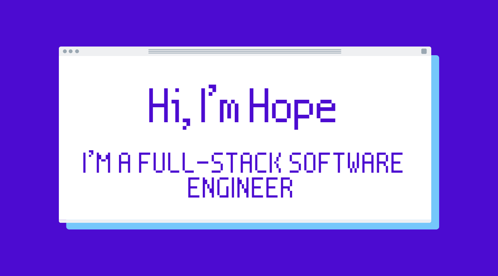

## 

I have recently made a career change into software engineering having always been interested in tech. 

Having studied accounting and finance at university, I worked in the industry for 3 years but I felt like I was undervalued, under-challenged and wanted to do something more creative. 

After uni I did some travelling and I created a blog online. I really enjoyed building my blog but wanted more flexibility for the design and functionality. I started looking into how to do this and discovered a newfound interest in coding. 

I enrolled in the _nology course to further my learning and to help me with my career change. The _nology course has really cemented my interest in tech and my love for learning and being creative. I have really enjoyed being challenged and pushed out of my comfort zone and it has also allowed me to further develop my logical skills.

---

## Languages, Frameworks, and Tools:

<!-- html5 -->

<!-- css3 -->

<!-- scss -->

<!-- javascript -->

<!-- React -->

<!-- jest -->

<!-- NodeJS -->

<!-- npm -->

<!-- java -->

<!-- Spring boot -->

<!-- junit -->

<!-- Google Cloud Platform -->

<!-- MySQL -->

<!-- Postman -->

---

## My Stats

---

## Connect with me

<!-- LinkedIn -->

---

## Check out my portfolio

https://hope-sugden.github.io/portfolio-react/
